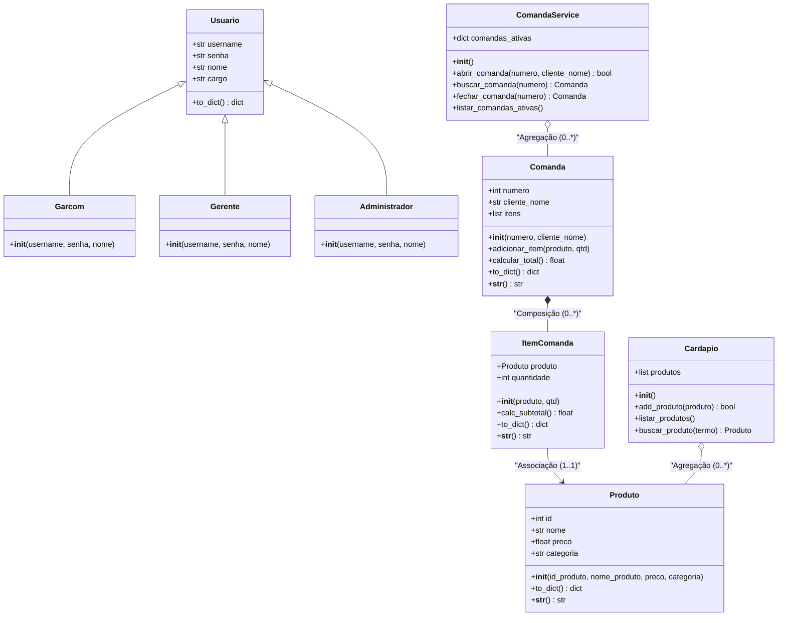

# UnPED - Sistema de Comandas para Bares e Restaurantes

Este projeto é um sistema de comandas para restaurantes e bares, desenvolvido como projeto prático para a matéria de Programação Orientada a Objetos (OO) da Universidade de Brasília (UnB).

O sistema usa uma interface gráfica construída com a biblioteca `customtkinter`, simulando um terminal de PDV (Ponto de Venda) com diferentes níveis de acesso (Garçom, Gerente, Administrador) e salvando as informações em arquivos JSON.

---

## 🏗️ Estrutura de Pastas e Arquivos do Projeto

O projeto foi dividido em pacotes para organizar as responsabilidades de cada classe e arquivo:

*   **📂 `models/`** (Pasta de Modelos de Dados)
    *   **📄 `produto.py`**: Representa um produto do cardápio (ID, nome, preço, categoria) com validação de dados.
    *   **📄 `item_comanda.py`**: Representa a linha de consumo, associando um produto a uma quantidade.
    *   **📄 `comanda.py`**: Representa a comanda de consumo, com o número, o nome do cliente e a lista de itens pedidos.
    *   **📄 `cardapio.py`**: Gerencia a lista de produtos cadastrados no sistema.
    *   **📄 `usuario.py`**: Define os usuários do sistema (`Garcom`, `Gerente` e `Administrador`).
*   **📂 `services/`** (Pasta de Lógica e Persistência)
    *   **📄 `comanda_service.py`**: Gerencia as comandas abertas na memória do programa.
    *   **📄 `persistencia.py`**: Salva e lê as informações nos arquivos JSON.
*   **📂 `views/`** (Pasta de Interface Gráfica)
    *   **📄 `login.py`**: Tela de login com opção de visualizar senha e fluxo para criar o administrador inicial caso o banco de dados seja deletado.
    *   **📄 `dashboard.py`**: Painel principal com a listagem de comandas ativas e abertura de novas contas.
    *   **📄 `detalhe_pedido.py`**: Tela de lançamento de pedidos em estilo mobile (com botões de categorias e produtos) e transferência de itens.
    *   **📄 `cardapio.py`**: Tela para cadastrar e remover produtos do cardápio.
    *   **📄 `usuarios.py`**: Tela para gerenciar e remover colaboradores do sistema.
    *   **📄 `fechar_comanda.py`**: Tela de fechamento de conta com cálculo de taxa de 10% e troco.
*   **📂 `data/`** (Pasta de Arquivos de Armazenamento)
    *   **📄 `cardapio.json`**: Lista de produtos salvos.
    *   **📄 `comandas.json`**: Comandas ativas salvas.
    *   **📄 `usuarios.json`**: Operadores cadastrados.
*   **📄 `app.py`**: Arquivo principal que inicia a aplicação gráfica.

---

## 📊 Modelagem UML (Diagrama de Classes)

O diagrama abaixo descreve a estrutura das classes, seus atributos, métodos e como elas se relacionam.



---

## 🧠 Conceitos de OO aplicados ao projeto

### 1. Associação, Agregação e Composição
*   **Associação:** A classe `ItemComanda` se associa à classe `Produto` para saber o preço e os dados do produto.
*   **Agregação:** A classe `Cardapio` guarda uma agregação de `Produto`. Se o cardápio for limpo ou recriado, os produtos ainda podem existir de forma isolada na lógica do negócio.
*   **Composição:** A classe `Comanda` é composta por instâncias de `ItemComanda`. Se a comanda for encerrada e removida do sistema, todos os seus itens associados também deixam de existir.

### 2. Herança e Polimorfismo
*   A classe `Usuario` serve de base com os atributos comuns. As classes `Garcom`, `Gerente` e `Administrador` herdam dela.
*   **Polimorfismo:** A interface se adapta de acordo com o tipo de usuário logado. O menu lateral oculta ou exibe abas (por exemplo, garçom não vê usuários nem o cardápio) e o botão de transferência de itens só aparece para gerentes e administradores.

### 3. Encapsulamento e Validação
*   Colocamos validações nos construtores das classes (`Produto`, `ItemComanda`, `Comanda`) para que o sistema impeça a criação de objetos inconsistentes, como produtos com preços negativos ou comandas com quantidades menores ou iguais a zero.

---

## 🚀 Como executar o projeto

Você vai precisar do Python 3.10 ou superior instalado.

```bash
# 1. Clone o repositório
git clone https://github.com/Figueirin/UnPED

# 2. Acesse a pasta do projeto
cd UnPED

# 3. Instale a biblioteca CustomTkinter
pip install customtkinter

# 4. Execute a aplicação
python app.py
```
