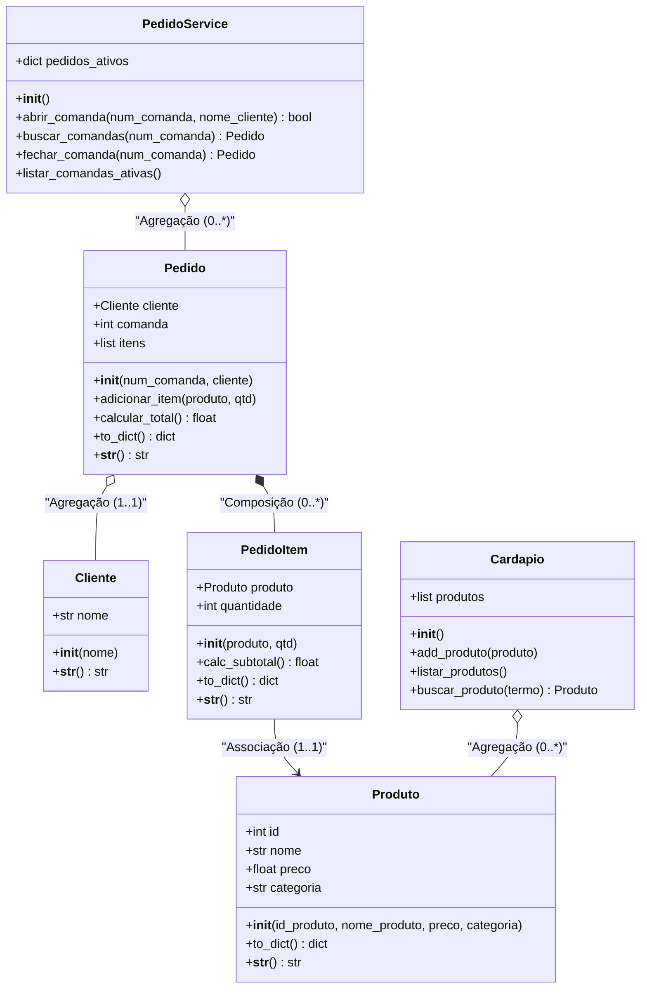

# UnPED - Sistema de Comandas para Bares e Restaurantes

Este projeto é um sistema de comandas ("comandas de consumo") para restaurantes e bares, desenvolvido como projeto prático para a matéria de Programação Orientada a Objetos (OO) da Universidade de Brasília (UnB).

O objetivo do sistema é simular um terminal de PDV (Ponto de Venda) para o garçom: abrir comandas com número e nome, lançar itens pelo nome ou ID, exibir o extrato de consumo parcial com taxas e realizar o fechamento interativo da conta com cálculo de taxa de serviço (10%) e controle de pagamentos (com troco). Toda a persistência é feita localmente em arquivos JSON salvos de forma assíncrona/automatizada a cada operação.

---

## 🏗️ Estrutura de Pastas do Projeto

Para manter o código organizado e garantir o **Princípio da Responsabilidade Única (SRP)**, o projeto foi modularizado da seguinte forma:

* `models/`: Classes que representam as entidades de negócio (os dados e suas regras).
  * `cliente.py`: Representa o cliente (guarda apenas o nome).
  * `produto.py`: Representa um item do cardápio (ID, nome, preço e categoria).
  * `pedido_item.py`: Representa a linha do pedido (associa um `Produto` a uma quantidade).
  * `pedido.py`: A comanda ativa (agrupa o cliente, número da comanda, itens consumidos e calcula taxas).
  * `cardapio.py`: Gerencia a lista de produtos disponíveis.
* `services/`: Lógica de controle e persistência de dados.
  * `pedido_service.py`: Controla o estado das comandas ativas na memória (abrir, buscar, listar e fechar).
  * `persistencia.py`: Serializa e deserializa os dados em JSON, com tratamento de compatibilidade.
* `utils/`: Funções utilitárias e interface.
  * `menu.py`: Agrupa os fluxos de interface do terminal e as funções de validação de input de dados.
* `data/`: Pasta contendo os arquivos de persistência (`cardapio.json` e `pedidos.json`).
* `main.py`: Bootstrapper do sistema que inicia os serviços e roda o menu.

---

## 📊 Modelagem UML (Diagrama de Classes)

O diagrama abaixo descreve a estrutura de classes e seus respectivos atributos, métodos e tipos de relacionamentos.



---

## 🧠 Conceitos de OO aplicados ao projeto

### 1. Associação, Agregação e Composição
* **Associação:** O `PedidoItem` possui uma associação direta a um objeto do tipo `Produto` para consultar seu preço e dados.
* **Agregação:** O `Pedido` agrega um `Cliente`. Se a comanda for encerrada e excluída, o objeto do `Cliente` continua fazendo sentido isoladamente no sistema (relação fraca). O mesmo ocorre entre `Cardapio` e `Produto`.
* **Composição:** O `Pedido` é composto de `PedidoItem`. Se o pedido principal for excluído da memória, todas as linhas de consumo pertencentes a ele morrem juntas (relação forte de ciclo de vida).

### 2. Delegação de Responsabilidade e DRY (Don't Repeat Yourself)
* Para calcular o total do item, `PedidoItem` chama `calc_subtotal()`, que por sua vez delega o preço ao `Produto` (`self.produto.preco * self.quantidade`).
* O extrato completo do pedido centraliza as lógicas de formatação, cálculo de subtotal, aplicação de taxa de serviço (10%) e total geral diretamente no método mágico `__str__` da classe `Pedido`. Tanto o fluxo de ver extrato parcial (Opção 3) quanto o fluxo de fechamento (Opção 4) utilizam o método `print(pedido)` para exibir as informações unificadas, eliminando duplicações no código.

### 3. Padrão de Roteamento Pythônico (Dispatcher Pattern)
Na `main.py`, preferi substituír o tradicional encadeamento de dezenas de estruturas `if-elif-else` por um **dicionário de funções** mapeadas por opção digitada:
```python
acoes = {
    "1": fluxo_abrir_comanda,
    "2": fluxo_adicionar_item,
    "3": fluxo_ver_extrato,
    # ...
}
```
Isso torna o fluxo de controle extremamente elegante, modular e fácil de expandir (basta adicionar uma nova chave e criar a função correspondente sem mexer no loop do menu).

### 4. Tratamento de Exceções e Resiliência
* Todos os inputs numéricos passam por funções auxiliares de tratamento (`obter_inteiro` e `obter_float`), que utilizam um loop com bloco `try/except ValueError` para garantir que o console não quebre caso o usuário digite texto onde deveria digitar valores numéricos.
* O sistema de busca de produtos aceita buscas flexíveis (seja pelo número do ID do produto ou pelo nome exato, sem distinção de maiúsculas e minúsculas).

---

## 💾 Persistência de Dados
Desenvolvi uma camada de persistência em arquivos JSON locais na pasta `data/`.
Toda vez que uma nova comanda é aberta, um produto é lançado, ou uma conta é fechada, a persistência é ativada em segundo plano. O sistema também implementa checagem com métodos `.get()` para garantir compatibilidade caso arquivos JSON gerados em versões antigas do app sejam carregados.

---

## 🚀 Como executar o projeto

Abra o seu terminal e execute os comandos abaixo para clonar o repositório e rodar o sistema:

```bash
# 1. Clone o repositório
git clone https://github.com/Figueirin/UnPED

# 2. Acesse a pasta do projeto
cd UnPED

# 3. Execute o programa
python main.py
```

